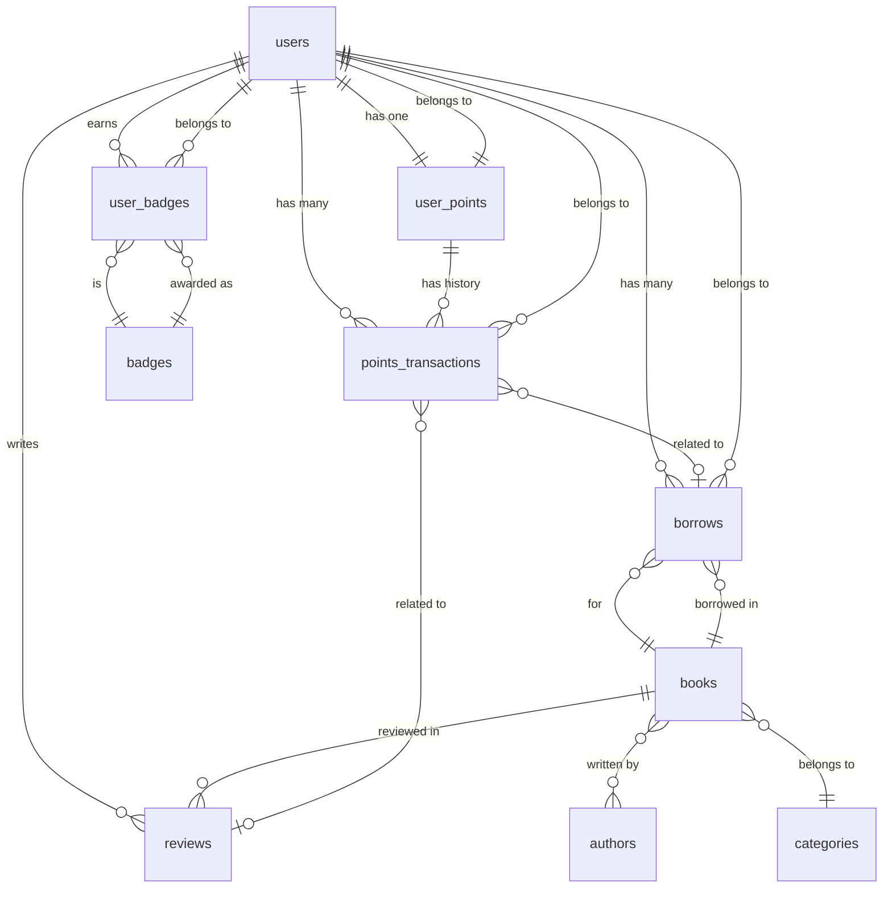

# 💾 数据库架构设计

图书馆管理系统采用MySQL 8.0作为主数据库，使用Sequelize ORM进行数据访问。数据库设计遵循第三范式，确保数据一致性和查询性能。

## 🏗️ 数据库概览

### 核心设计原则
- **数据一致性**: 使用外键约束确保引用完整性
- **查询性能**: 合理的索引设计和查询优化
- **扩展性**: 支持水平和垂直扩展
- **安全性**: 敏感数据加密和访问控制
- **审计追踪**: 完整的操作日志记录

### 表命名规范
- 表名使用复数形式（如 `users`, `books`）
- 字段名使用下划线命名法（snake_case）
- 关联表使用描述性名称（如 `user_points`, `points_transactions`）

## 📊 实体关系图



## 📋 表结构详解

### 👥 users - 用户表

存储系统中所有用户的基本信息，包括读者和管理员。

```sql
CREATE TABLE `users` (
  `id` INT UNSIGNED NOT NULL AUTO_INCREMENT,
  `username` VARCHAR(50) NOT NULL UNIQUE,
  `email` VARCHAR(100) UNIQUE,
  `password_hash` VARCHAR(255),
  `real_name` VARCHAR(50),
  `phone` VARCHAR(20),
  `avatar` VARCHAR(255),
  `bio` TEXT,
  `wechat_openid` VARCHAR(128) UNIQUE COMMENT '微信用户唯一标识',
  `wechat_unionid` VARCHAR(128) UNIQUE COMMENT '微信开放平台统一标识',
  `role` ENUM('patron', 'admin') NOT NULL DEFAULT 'patron',
  `status` ENUM('active', 'inactive', 'suspended', 'banned') NOT NULL DEFAULT 'active',
  `email_verified` BOOLEAN DEFAULT FALSE,
  `email_verification_token` VARCHAR(255),
  `phone_verified` BOOLEAN DEFAULT FALSE,
  `last_login_at` TIMESTAMP NULL,
  `last_login_ip` VARCHAR(45),
  `login_count` INT UNSIGNED DEFAULT 0,
  `preferences` JSON DEFAULT NULL,
  `is_deleted` BOOLEAN DEFAULT FALSE,
  `deleted_at` TIMESTAMP NULL,
  `created_at` TIMESTAMP NOT NULL DEFAULT CURRENT_TIMESTAMP,
  `updated_at` TIMESTAMP NOT NULL DEFAULT CURRENT_TIMESTAMP ON UPDATE CURRENT_TIMESTAMP,
  PRIMARY KEY (`id`),
  INDEX `idx_username` (`username`),
  INDEX `idx_email` (`email`),
  INDEX `idx_role` (`role`),
  INDEX `idx_status` (`status`),
  INDEX `idx_last_login` (`last_login_at`)
) ENGINE=InnoDB DEFAULT CHARSET=utf8mb4 COLLATE=utf8mb4_unicode_ci;
```

#### 字段说明
| 字段 | 类型 | 说明 | 约束 |
|------|------|------|------|
| id | INT UNSIGNED | 用户唯一标识 | 主键，自增 |
| username | VARCHAR(50) | 用户名 | 唯一，非空 |
| email | VARCHAR(100) | 邮箱地址 | 唯一，可空 |
| password_hash | VARCHAR(255) | 密码哈希 | bcrypt加密 |
| real_name | VARCHAR(50) | 真实姓名 | 可空 |
| wechat_openid | VARCHAR(128) | 微信OpenID | 唯一，用于微信登录 |
| role | ENUM | 用户角色 | patron(读者)/admin(管理员) |
| status | ENUM | 账户状态 | active/inactive/suspended/banned |
| preferences | JSON | 用户偏好设置 | JSON格式存储 |

### 📚 books - 图书表

存储图书馆所有图书的详细信息。

```sql
CREATE TABLE `books` (
  `id` INT UNSIGNED NOT NULL AUTO_INCREMENT,
  `title` VARCHAR(255) NOT NULL,
  `subtitle` VARCHAR(255),
  `isbn` VARCHAR(20) NOT NULL UNIQUE,
  `authors` JSON NOT NULL DEFAULT '[]',
  `publisher` VARCHAR(100),
  `publication_year` YEAR,
  `publication_date` DATE,
  `language` VARCHAR(20) NOT NULL DEFAULT 'zh-CN',
  `category` VARCHAR(50),
  `subcategory` VARCHAR(50),
  `tags` JSON DEFAULT '[]',
  `summary` TEXT,
  `description` TEXT,
  `table_of_contents` TEXT,
  `cover_image` VARCHAR(255),
  `back_cover_image` VARCHAR(255),
  `total_stock` INT UNSIGNED NOT NULL DEFAULT 0,
  `available_stock` INT UNSIGNED NOT NULL DEFAULT 0,
  `reserved_stock` INT UNSIGNED NOT NULL DEFAULT 0,
  `status` ENUM('available', 'borrowed', 'reserved', 'maintenance', 'retired') NOT NULL DEFAULT 'available',
  `location` VARCHAR(50) COMMENT '图书在图书馆的位置',
  `call_number` VARCHAR(50) COMMENT '图书索书号',
  `price` DECIMAL(10,2),
  `pages` INT UNSIGNED,
  `format` VARCHAR(20) COMMENT '图书格式，如平装、精装等',
  `dimensions` VARCHAR(50) COMMENT '图书尺寸',
  `weight` INT UNSIGNED COMMENT '图书重量（克）',
  `ebook_url` VARCHAR(255) COMMENT '电子书文件路径',
  `ebook_format` VARCHAR(10) COMMENT '电子书格式，如PDF、EPUB等',
  `ebook_file_size` INT UNSIGNED COMMENT '电子书文件大小（字节）',
  `has_ebook` BOOLEAN DEFAULT FALSE,
  `borrow_count` INT UNSIGNED DEFAULT 0,
  `reserve_count` INT UNSIGNED DEFAULT 0,
  `view_count` INT UNSIGNED DEFAULT 0,
  `download_count` INT UNSIGNED DEFAULT 0,
  `average_rating` DECIMAL(3,2),
  `review_count` INT UNSIGNED DEFAULT 0,
  `acquired_date` DATE COMMENT '图书入库日期',
  `acquired_from` VARCHAR(100) COMMENT '图书来源',
  `condition` ENUM('new', 'good', 'fair', 'poor', 'damaged') DEFAULT 'new',
  `notes` TEXT COMMENT '管理员备注',
  `is_deleted` BOOLEAN DEFAULT FALSE,
  `deleted_at` TIMESTAMP NULL,
  `created_at` TIMESTAMP NOT NULL DEFAULT CURRENT_TIMESTAMP,
  `updated_at` TIMESTAMP NOT NULL DEFAULT CURRENT_TIMESTAMP ON UPDATE CURRENT_TIMESTAMP,
  PRIMARY KEY (`id`),
  UNIQUE KEY `uk_isbn` (`isbn`),
  INDEX `idx_title` (`title`),
  INDEX `idx_category` (`category`),
  INDEX `idx_publisher` (`publisher`),
  INDEX `idx_publication_year` (`publication_year`),
  INDEX `idx_status` (`status`),
  INDEX `idx_has_ebook` (`has_ebook`),
  INDEX `idx_average_rating` (`average_rating`),
  INDEX `idx_borrow_count` (`borrow_count`),
  FULLTEXT INDEX `ft_title_summary` (`title`, `summary`)
) ENGINE=InnoDB DEFAULT CHARSET=utf8mb4 COLLATE=utf8mb4_unicode_ci;
```

#### 特殊字段说明
- **authors**: JSON数组存储多个作者信息
- **tags**: JSON数组存储图书标签
- **stock字段**: total_stock(总库存), available_stock(可借库存), reserved_stock(预约库存)
- **统计字段**: 借阅次数、评分、浏览量等用于推荐算法

### 📋 borrows - 借阅记录表

记录所有的图书借阅信息，是用户和图书之间的多对多关系表。

```sql
CREATE TABLE `borrows` (
  `id` INT UNSIGNED NOT NULL AUTO_INCREMENT,
  `user_id` INT UNSIGNED NOT NULL,
  `book_id` INT UNSIGNED NOT NULL,
  `borrow_date` TIMESTAMP NOT NULL DEFAULT CURRENT_TIMESTAMP,
  `due_date` TIMESTAMP NOT NULL,
  `return_date` TIMESTAMP NULL,
  `actual_return_date` TIMESTAMP NULL COMMENT '实际归还日期',
  `status` ENUM('borrowed', 'returned', 'overdue', 'lost', 'damaged') NOT NULL DEFAULT 'borrowed',
  `borrow_days` INT UNSIGNED NOT NULL DEFAULT 30,
  `renewal_count` INT UNSIGNED DEFAULT 0,
  `max_renewals` INT UNSIGNED DEFAULT 2,
  `overdue_days` INT UNSIGNED DEFAULT 0,
  `fine` DECIMAL(10,2) DEFAULT 0.00,
  `fine_paid` BOOLEAN DEFAULT FALSE,
  `condition` ENUM('good', 'damaged', 'lost') DEFAULT 'good',
  `damage_description` TEXT,
  `return_notes` TEXT,
  `borrow_notes` TEXT,
  `notifications_sent` JSON DEFAULT '[]',
  `points_earned` INT DEFAULT 0,
  `points_deducted` INT DEFAULT 0,
  `processed_by` INT UNSIGNED COMMENT '处理此借阅的管理员ID',
  `borrow_location` VARCHAR(100),
  `return_location` VARCHAR(100),
  `is_deleted` BOOLEAN DEFAULT FALSE,
  `created_at` TIMESTAMP NOT NULL DEFAULT CURRENT_TIMESTAMP,
  `updated_at` TIMESTAMP NOT NULL DEFAULT CURRENT_TIMESTAMP ON UPDATE CURRENT_TIMESTAMP,
  PRIMARY KEY (`id`),
  INDEX `idx_user_id` (`user_id`),
  INDEX `idx_book_id` (`book_id`),
  INDEX `idx_status` (`status`),
  INDEX `idx_borrow_date` (`borrow_date`),
  INDEX `idx_due_date` (`due_date`),
  INDEX `idx_return_date` (`return_date`),
  INDEX `idx_user_status` (`user_id`, `status`),
  INDEX `idx_book_status` (`book_id`, `status`),
  UNIQUE KEY `uk_active_borrow` (`user_id`, `book_id`, `status`),
  FOREIGN KEY (`user_id`) REFERENCES `users`(`id`) ON DELETE RESTRICT,
  FOREIGN KEY (`book_id`) REFERENCES `books`(`id`) ON DELETE RESTRICT,
  FOREIGN KEY (`processed_by`) REFERENCES `users`(`id`) ON DELETE SET NULL
) ENGINE=InnoDB DEFAULT CHARSET=utf8mb4 COLLATE=utf8mb4_unicode_ci;
```

#### 业务逻辑说明
- **借阅状态流转**: borrowed → returned/overdue → (可能)lost/damaged
- **续借限制**: max_renewals字段控制最大续借次数
- **逾期处理**: 自动计算逾期天数和罚金
- **积分记录**: 记录本次借阅相关的积分变动

### 🎮 user_points - 用户积分表

存储每个用户的当前积分余额和等级信息。

```sql
CREATE TABLE `user_points` (
  `user_id` INT UNSIGNED NOT NULL,
  `balance` INT NOT NULL DEFAULT 0 COMMENT '当前积分余额',
  `total_earned` INT UNSIGNED DEFAULT 0 COMMENT '历史总获得积分',
  `total_spent` INT UNSIGNED DEFAULT 0 COMMENT '历史总消费积分',
  `level` VARCHAR(20) NOT NULL DEFAULT 'NEWCOMER' COMMENT '用户等级',
  `level_name` VARCHAR(50) NOT NULL DEFAULT '新手读者' COMMENT '等级名称',
  `next_level_points` INT UNSIGNED COMMENT '升级到下一等级所需积分',
  `progress_to_next_level` DECIMAL(5,2) DEFAULT 0.00 COMMENT '升级进度百分比',
  `last_transaction_at` TIMESTAMP NULL COMMENT '最后一次积分变动时间',
  `borrow_points` INT UNSIGNED DEFAULT 0 COMMENT '借阅获得的积分',
  `review_points` INT UNSIGNED DEFAULT 0 COMMENT '书评获得的积分',
  `bonus_points` INT UNSIGNED DEFAULT 0 COMMENT '奖励获得的积分',
  `penalty_points` INT UNSIGNED DEFAULT 0 COMMENT '被扣除的积分',
  `badge_count` INT UNSIGNED DEFAULT 0 COMMENT '获得的徽章数量',
  `rank_position` INT UNSIGNED COMMENT '积分排名位置',
  `last_rank_update` TIMESTAMP NULL COMMENT '最后排名更新时间',
  `created_at` TIMESTAMP NOT NULL DEFAULT CURRENT_TIMESTAMP,
  `updated_at` TIMESTAMP NOT NULL DEFAULT CURRENT_TIMESTAMP ON UPDATE CURRENT_TIMESTAMP,
  PRIMARY KEY (`user_id`),
  INDEX `idx_balance` (`balance`),
  INDEX `idx_level` (`level`),
  INDEX `idx_rank_position` (`rank_position`),
  INDEX `idx_total_earned` (`total_earned`),
  INDEX `idx_last_transaction` (`last_transaction_at`),
  FOREIGN KEY (`user_id`) REFERENCES `users`(`id`) ON DELETE CASCADE
) ENGINE=InnoDB DEFAULT CHARSET=utf8mb4 COLLATE=utf8mb4_unicode_ci;
```

#### 等级系统设计
| 等级代码 | 等级名称 | 积分范围 | 特权 |
|---------|---------|----------|------|
| NEWCOMER | 新手读者 | 0-99 | 基础借阅权限 |
| READER | 普通读者 | 100-299 | 延长借阅期限 |
| BOOKWORM | 书虫 | 300-699 | 优先预约权 |
| SCHOLAR | 学者 | 700-1499 | 专家资源访问 |
| EXPERT | 专家 | 1500-2999 | VIP服务 |
| MASTER | 大师 | 3000-5999 | 定制化服务 |
| GRANDMASTER | 宗师 | 6000+ | 所有特权 |

### 💰 points_transactions - 积分流水表

记录所有积分变动的详细历史，确保积分系统的可审计性。

```sql
CREATE TABLE `points_transactions` (
  `id` BIGINT UNSIGNED NOT NULL AUTO_INCREMENT,
  `user_id` INT UNSIGNED NOT NULL,
  `points_change` INT NOT NULL COMMENT '积分变动值，正数为增加，负数为减少',
  `current_balance` INT NOT NULL COMMENT '本次交易后的余额',
  `previous_balance` INT NOT NULL COMMENT '本次交易前的余额',
  `transaction_type` ENUM(
    'BORROW_BOOK', 'RETURN_ON_TIME', 'RETURN_LATE', 'WRITE_REVIEW',
    'COMPLETE_TUTORIAL', 'ADMIN_ADJUSTMENT', 'PENALTY_DEDUCTION',
    'BONUS_REWARD', 'REDEEM_REWARD'
  ) NOT NULL,
  `description` VARCHAR(255) NOT NULL COMMENT '交易描述',
  `related_entity_type` VARCHAR(50) COMMENT '关联实体类型',
  `related_entity_id` INT UNSIGNED COMMENT '关联实体ID',
  `metadata` JSON COMMENT '附加元数据',
  `processed_by` INT UNSIGNED COMMENT '处理此交易的管理员ID',
  `batch_id` VARCHAR(36) COMMENT '批量操作ID',
  `status` ENUM('pending', 'completed', 'failed', 'reversed') DEFAULT 'completed',
  `reversal_transaction_id` BIGINT UNSIGNED COMMENT '冲正交易ID',
  `original_transaction_id` BIGINT UNSIGNED COMMENT '原始交易ID',
  `expires_at` TIMESTAMP NULL COMMENT '积分过期时间',
  `ip_address` VARCHAR(45) COMMENT '操作IP地址',
  `user_agent` VARCHAR(255) COMMENT '用户代理信息',
  `notes` TEXT COMMENT '交易备注',
  `created_at` TIMESTAMP NOT NULL DEFAULT CURRENT_TIMESTAMP,
  PRIMARY KEY (`id`),
  INDEX `idx_user_id` (`user_id`),
  INDEX `idx_transaction_type` (`transaction_type`),
  INDEX `idx_created_at` (`created_at`),
  INDEX `idx_user_created` (`user_id`, `created_at`),
  INDEX `idx_user_type` (`user_id`, `transaction_type`),
  INDEX `idx_related_entity` (`related_entity_type`, `related_entity_id`),
  INDEX `idx_batch_id` (`batch_id`),
  INDEX `idx_status` (`status`),
  INDEX `idx_processed_by` (`processed_by`),
  FOREIGN KEY (`user_id`) REFERENCES `users`(`id`) ON DELETE CASCADE,
  FOREIGN KEY (`processed_by`) REFERENCES `users`(`id`) ON DELETE SET NULL,
  FOREIGN KEY (`reversal_transaction_id`) REFERENCES `points_transactions`(`id`),
  FOREIGN KEY (`original_transaction_id`) REFERENCES `points_transactions`(`id`)
) ENGINE=InnoDB DEFAULT CHARSET=utf8mb4 COLLATE=utf8mb4_unicode_ci;
```

#### 积分获取规则
| 交易类型 | 积分变化 | 触发条件 | 描述 |
|---------|---------|----------|------|
| BORROW_BOOK | +10 | 成功借阅图书 | 鼓励借阅行为 |
| RETURN_ON_TIME | +5 | 按时归还图书 | 奖励守时行为 |
| WRITE_REVIEW | +25 | 发表书评 | 鼓励分享阅读心得 |
| COMPLETE_TUTORIAL | +50 | 完成新手引导 | 引导用户熟悉系统 |
| RETURN_LATE | -10 | 逾期归还 | 惩罚逾期行为 |
| REDEEM_REWARD | 动态 | 积分兑换 | 积分消费 |

### ⭐ reviews - 书评表

存储用户对图书的评价和评分信息。

```sql
CREATE TABLE `reviews` (
  `id` INT UNSIGNED NOT NULL AUTO_INCREMENT,
  `user_id` INT UNSIGNED NOT NULL,
  `book_id` INT UNSIGNED NOT NULL,
  `rating` TINYINT UNSIGNED NOT NULL COMMENT '评分 1-5',
  `title` VARCHAR(100) COMMENT '评论标题',
  `content` TEXT NOT NULL COMMENT '评论内容',
  `is_anonymous` BOOLEAN DEFAULT FALSE COMMENT '是否匿名评论',
  `is_spoiler` BOOLEAN DEFAULT FALSE COMMENT '是否包含剧透',
  `likes_count` INT UNSIGNED DEFAULT 0 COMMENT '点赞数',
  `helpful_count` INT UNSIGNED DEFAULT 0 COMMENT '有用数',
  `status` ENUM('pending', 'approved', 'rejected', 'hidden') DEFAULT 'approved',
  `moderated_by` INT UNSIGNED COMMENT '审核人员ID',
  `moderated_at` TIMESTAMP NULL COMMENT '审核时间',
  `moderation_reason` VARCHAR(255) COMMENT '审核原因',
  `points_awarded` INT DEFAULT 0 COMMENT '获得的积分',
  `is_deleted` BOOLEAN DEFAULT FALSE,
  `deleted_at` TIMESTAMP NULL,
  `created_at` TIMESTAMP NOT NULL DEFAULT CURRENT_TIMESTAMP,
  `updated_at` TIMESTAMP NOT NULL DEFAULT CURRENT_TIMESTAMP ON UPDATE CURRENT_TIMESTAMP,
  PRIMARY KEY (`id`),
  INDEX `idx_user_id` (`user_id`),
  INDEX `idx_book_id` (`book_id`),
  INDEX `idx_rating` (`rating`),
  INDEX `idx_status` (`status`),
  INDEX `idx_created_at` (`created_at`),
  INDEX `idx_likes_count` (`likes_count`),
  UNIQUE KEY `uk_user_book` (`user_id`, `book_id`),
  FOREIGN KEY (`user_id`) REFERENCES `users`(`id`) ON DELETE CASCADE,
  FOREIGN KEY (`book_id`) REFERENCES `books`(`id`) ON DELETE CASCADE,
  FOREIGN KEY (`moderated_by`) REFERENCES `users`(`id`) ON DELETE SET NULL
) ENGINE=InnoDB DEFAULT CHARSET=utf8mb4 COLLATE=utf8mb4_unicode_ci;
```

## 🔧 数据库配置

### 连接池配置
```javascript
{
  pool: {
    max: 20,        // 最大连接数
    min: 5,         // 最小连接数
    acquire: 60000, // 获取连接超时时间(ms)
    idle: 10000     // 连接空闲时间(ms)
  }
}
```

### 字符集配置
```sql
DEFAULT CHARSET=utf8mb4 COLLATE=utf8mb4_unicode_ci
```
- 支持完整的UTF-8字符集，包括emoji
- 使用unicode排序规则确保正确的字符比较

### 索引策略
1. **主键索引**: 所有表都有自增主键
2. **唯一索引**: 用户名、邮箱、ISBN等唯一字段
3. **外键索引**: 所有外键字段自动创建索引
4. **复合索引**: 查询频繁的字段组合
5. **全文索引**: 图书标题和摘要支持全文搜索

## 🚀 性能优化

### 查询优化
- 使用prepared statements防止SQL注入
- 合理使用JOIN，避免N+1查询问题
- 实现分页查询减少内存使用
- 使用索引覆盖减少回表查询

### 缓存策略
- Redis缓存热点数据（用户信息、图书信息）
- 查询结果缓存（排行榜、统计数据）
- 会话缓存（JWT黑名单、用户会话）

### 备份策略
- 每日自动全量备份
- 实时binlog备份
- 定期备份验证和恢复测试

## 📊 数据治理

### 数据清理
- 软删除机制保护重要数据
- 定期清理过期的临时数据
- 归档历史数据减少表大小

### 数据监控
- 慢查询日志监控
- 连接池使用率监控
- 存储空间监控
- 备份状态监控

### 数据安全
- 敏感字段加密存储
- 数据库连接加密
- 访问权限最小化原则
- 审计日志记录

---

📝 **注意**: 生产环境部署前请根据实际业务量调整连接池大小、索引策略和备份频率。