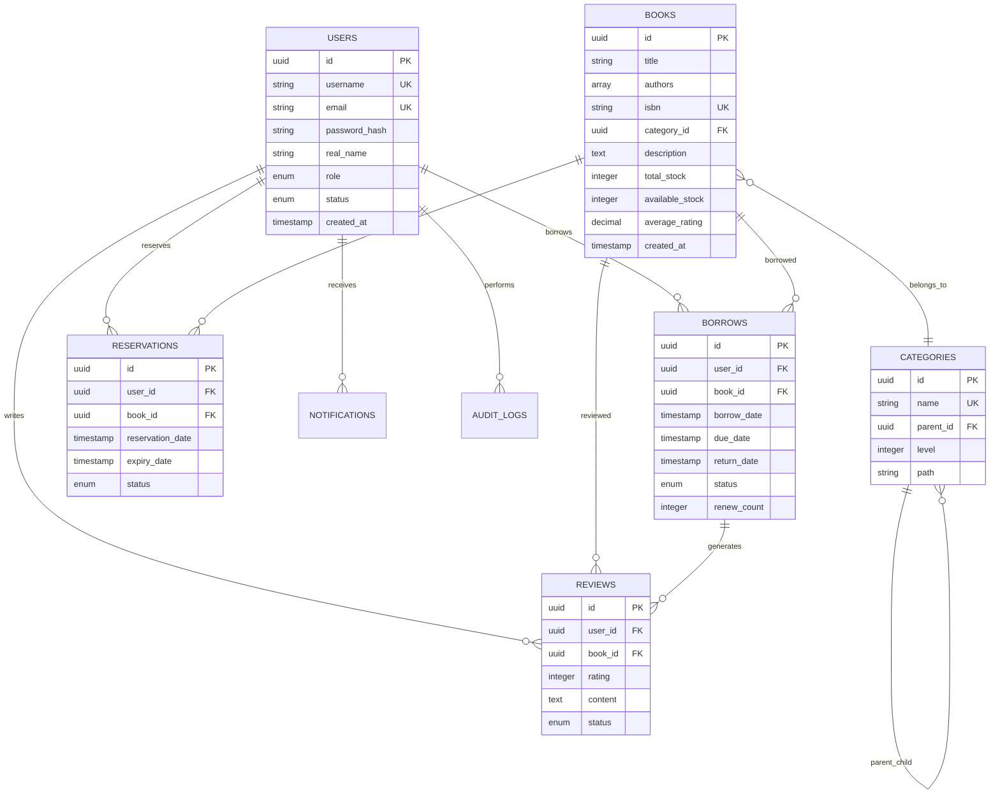

# 🗄️ 数据库设计文档

企业级图书管理系统的数据库架构设计，采用PostgreSQL作为主数据库，配合Redis缓存和Elasticsearch搜索引擎。

## 📋 目录

- [设计原则](#设计原则)
- [数据库架构](#数据库架构)
- [表结构设计](#表结构设计)
- [索引策略](#索引策略)
- [数据关系](#数据关系)
- [性能优化](#性能优化)
- [数据迁移](#数据迁移)
- [备份策略](#备份策略)

## 📐 设计原则

### 核心设计原则

1. **规范化与反规范化平衡**
   - 核心业务数据遵循第三范式
   - 查询频繁的统计数据适度反规范化
   - 使用物化视图优化复杂查询

2. **数据完整性**
   - 外键约束确保引用完整性
   - CHECK约束确保数据有效性
   - 触发器维护数据一致性

3. **可扩展性**
   - 支持水平分片
   - 读写分离架构
   - 分区表优化大数据量查询

4. **高可用性**
   - 主从复制
   - 自动故障转移
   - 数据备份和恢复

## 🏗️ 数据库架构

### 整体架构图

```
┌─────────────────────────────────────────────────────────────────┐
│                        应用层 (Application Layer)                 │
└─────────────────┬───────────────────────────────────────────────┘
                  │
┌─────────────────┴───────────────────────────────────────────────┐
│                    连接池 (Connection Pool)                      │
├─────────────────────────────────────────────────────────────────┤
│ • PgBouncer     • 连接复用    • 负载均衡    • 连接限制         │
└─────────────────┬───────────────────────────────────────────────┘
                  │
┌─────────────────┴───────────────────────────────────────────────┐
│                      主数据库集群 (Master Cluster)                │
├─────────────────────────────────────────────────────────────────┤
│                    PostgreSQL 15 (Primary)                     │
│ • 核心业务数据   • ACID事务     • 复杂查询    • 数据一致性      │
└─────────────────┬───────────────────────────────────────────────┘
                  │ Streaming Replication
┌─────────────────┴───────────────────────────────────────────────┐
│                      只读副本集群 (Read Replicas)                 │
├─────────────────────────────────────────────────────────────────┤
│   Replica 1    │   Replica 2    │   Replica 3    │   Replica 4  │
│   (实时读取)     │   (报表查询)     │   (分析统计)     │   (备份)      │
└─────────────────────────────────────────────────────────────────┘
```

### 存储引擎选择

```sql
-- 主数据库配置
-- PostgreSQL 15 with optimized settings
ALTER SYSTEM SET shared_buffers = '25% of RAM';
ALTER SYSTEM SET effective_cache_size = '75% of RAM';
ALTER SYSTEM SET work_mem = '16MB';
ALTER SYSTEM SET maintenance_work_mem = '1GB';
ALTER SYSTEM SET checkpoint_completion_target = 0.9;
ALTER SYSTEM SET wal_buffers = '16MB';
ALTER SYSTEM SET default_statistics_target = 100;
ALTER SYSTEM SET random_page_cost = 1.1;
ALTER SYSTEM SET effective_io_concurrency = 200;

-- 启用有用的扩展
CREATE EXTENSION IF NOT EXISTS "uuid-ossp";
CREATE EXTENSION IF NOT EXISTS "pg_trgm";
CREATE EXTENSION IF NOT EXISTS "btree_gin";
CREATE EXTENSION IF NOT EXISTS "pg_stat_statements";
```

## 📊 表结构设计

### 核心业务表

#### 1. 用户表 (users)
```sql
CREATE TABLE users (
    id UUID PRIMARY KEY DEFAULT uuid_generate_v4(),
    username VARCHAR(50) UNIQUE NOT NULL,
    email VARCHAR(255) UNIQUE NOT NULL,
    password_hash VARCHAR(255) NOT NULL,
    real_name VARCHAR(100),
    phone VARCHAR(20),
    role user_role NOT NULL DEFAULT 'user',
    status user_status NOT NULL DEFAULT 'active',
    avatar_url VARCHAR(500),
    bio TEXT,
    email_verified BOOLEAN DEFAULT FALSE,
    phone_verified BOOLEAN DEFAULT FALSE,
    last_login_at TIMESTAMP WITH TIME ZONE,
    login_count INTEGER DEFAULT 0,
    created_at TIMESTAMP WITH TIME ZONE DEFAULT CURRENT_TIMESTAMP,
    updated_at TIMESTAMP WITH TIME ZONE DEFAULT CURRENT_TIMESTAMP,
    deleted_at TIMESTAMP WITH TIME ZONE,
    
    -- 约束
    CONSTRAINT users_username_length CHECK (char_length(username) >= 3),
    CONSTRAINT users_email_format CHECK (email ~* '^[A-Za-z0-9._%+-]+@[A-Za-z0-9.-]+\.[A-Za-z]{2,}$'),
    CONSTRAINT users_phone_format CHECK (phone IS NULL OR phone ~* '^\+?[1-9]\d{1,14}$')
);

-- 用户角色枚举
CREATE TYPE user_role AS ENUM ('admin', 'librarian', 'user');

-- 用户状态枚举
CREATE TYPE user_status AS ENUM ('active', 'inactive', 'suspended', 'pending');

-- 创建触发器自动更新 updated_at
CREATE OR REPLACE FUNCTION update_updated_at_column()
RETURNS TRIGGER AS $$
BEGIN
    NEW.updated_at = CURRENT_TIMESTAMP;
    RETURN NEW;
END;
$$ language 'plpgsql';

CREATE TRIGGER update_users_updated_at BEFORE UPDATE ON users
    FOR EACH ROW EXECUTE FUNCTION update_updated_at_column();
```

#### 2. 图书分类表 (categories)
```sql
CREATE TABLE categories (
    id UUID PRIMARY KEY DEFAULT uuid_generate_v4(),
    name VARCHAR(100) UNIQUE NOT NULL,
    description TEXT,
    parent_id UUID REFERENCES categories(id),
    level INTEGER NOT NULL DEFAULT 0,
    path TEXT NOT NULL,
    sort_order INTEGER DEFAULT 0,
    is_active BOOLEAN DEFAULT TRUE,
    created_at TIMESTAMP WITH TIME ZONE DEFAULT CURRENT_TIMESTAMP,
    updated_at TIMESTAMP WITH TIME ZONE DEFAULT CURRENT_TIMESTAMP,
    
    -- 约束
    CONSTRAINT categories_level_check CHECK (level >= 0 AND level <= 3),
    CONSTRAINT categories_no_self_parent CHECK (id != parent_id)
);

-- 创建层次路径索引
CREATE INDEX idx_categories_path ON categories USING btree(path);
CREATE INDEX idx_categories_parent ON categories(parent_id) WHERE parent_id IS NOT NULL;
```

#### 3. 图书表 (books)
```sql
CREATE TABLE books (
    id UUID PRIMARY KEY DEFAULT uuid_generate_v4(),
    title VARCHAR(500) NOT NULL,
    subtitle VARCHAR(500),
    authors TEXT[] NOT NULL,
    translator TEXT[],
    isbn VARCHAR(20) UNIQUE,
    isbn13 VARCHAR(20),
    publisher VARCHAR(200),
    publication_year INTEGER,
    pages INTEGER,
    language VARCHAR(10) DEFAULT 'zh-CN',
    category_id UUID NOT NULL REFERENCES categories(id),
    description TEXT,
    table_of_contents TEXT,
    cover_image_url VARCHAR(500),
    thumbnail_url VARCHAR(500),
    file_url VARCHAR(500),
    file_size BIGINT,
    file_format VARCHAR(20),
    total_stock INTEGER NOT NULL DEFAULT 0,
    available_stock INTEGER NOT NULL DEFAULT 0,
    reserved_stock INTEGER NOT NULL DEFAULT 0,
    borrow_count INTEGER DEFAULT 0,
    view_count INTEGER DEFAULT 0,
    download_count INTEGER DEFAULT 0,
    average_rating DECIMAL(3,2) DEFAULT 0,
    rating_count INTEGER DEFAULT 0,
    tags TEXT[],
    keywords TEXT[],
    is_ebook BOOLEAN DEFAULT FALSE,
    is_featured BOOLEAN DEFAULT FALSE,
    is_bestseller BOOLEAN DEFAULT FALSE,
    is_new_arrival BOOLEAN DEFAULT FALSE,
    price DECIMAL(10,2),
    original_price DECIMAL(10,2),
    status book_status NOT NULL DEFAULT 'available',
    created_by UUID NOT NULL REFERENCES users(id),
    created_at TIMESTAMP WITH TIME ZONE DEFAULT CURRENT_TIMESTAMP,
    updated_at TIMESTAMP WITH TIME ZONE DEFAULT CURRENT_TIMESTAMP,
    published_at TIMESTAMP WITH TIME ZONE,
    deleted_at TIMESTAMP WITH TIME ZONE,
    
    -- 约束
    CONSTRAINT books_stock_check CHECK (
        total_stock >= 0 AND 
        available_stock >= 0 AND 
        reserved_stock >= 0 AND
        total_stock >= available_stock + reserved_stock
    ),
    CONSTRAINT books_rating_check CHECK (average_rating >= 0 AND average_rating <= 5),
    CONSTRAINT books_year_check CHECK (publication_year >= 1000 AND publication_year <= EXTRACT(YEAR FROM CURRENT_DATE) + 1),
    CONSTRAINT books_pages_check CHECK (pages IS NULL OR pages > 0),
    CONSTRAINT books_isbn_format CHECK (isbn IS NULL OR isbn ~* '^[0-9-X]+$')
);

-- 图书状态枚举
CREATE TYPE book_status AS ENUM ('available', 'unavailable', 'maintenance', 'discontinued');

-- 全文搜索索引
CREATE INDEX idx_books_fulltext ON books USING gin(
    to_tsvector('english', coalesce(title, '') || ' ' || 
                coalesce(subtitle, '') || ' ' || 
                coalesce(array_to_string(authors, ' '), '') || ' ' ||
                coalesce(description, ''))
);

-- 标签和关键词索引
CREATE INDEX idx_books_tags ON books USING gin(tags);
CREATE INDEX idx_books_keywords ON books USING gin(keywords);
```

#### 4. 借阅记录表 (borrows)
```sql
CREATE TABLE borrows (
    id UUID PRIMARY KEY DEFAULT uuid_generate_v4(),
    user_id UUID NOT NULL REFERENCES users(id),
    book_id UUID NOT NULL REFERENCES books(id),
    borrow_date TIMESTAMP WITH TIME ZONE NOT NULL DEFAULT CURRENT_TIMESTAMP,
    due_date TIMESTAMP WITH TIME ZONE NOT NULL,
    return_date TIMESTAMP WITH TIME ZONE,
    actual_return_date TIMESTAMP WITH TIME ZONE,
    status borrow_status NOT NULL DEFAULT 'active',
    renew_count INTEGER DEFAULT 0,
    max_renewals INTEGER DEFAULT 2,
    fine_amount DECIMAL(10,2) DEFAULT 0,
    fine_paid BOOLEAN DEFAULT FALSE,
    fine_paid_at TIMESTAMP WITH TIME ZONE,
    overdue_days INTEGER DEFAULT 0,
    reminder_sent_count INTEGER DEFAULT 0,
    last_reminder_at TIMESTAMP WITH TIME ZONE,
    notes TEXT,
    created_by UUID REFERENCES users(id),
    created_at TIMESTAMP WITH TIME ZONE DEFAULT CURRENT_TIMESTAMP,
    updated_at TIMESTAMP WITH TIME ZONE DEFAULT CURRENT_TIMESTAMP,
    
    -- 约束
    CONSTRAINT borrows_dates_check CHECK (borrow_date <= due_date),
    CONSTRAINT borrows_return_check CHECK (return_date IS NULL OR return_date >= borrow_date),
    CONSTRAINT borrows_renew_check CHECK (renew_count >= 0 AND renew_count <= max_renewals),
    CONSTRAINT borrows_fine_check CHECK (fine_amount >= 0),
    CONSTRAINT borrows_overdue_check CHECK (overdue_days >= 0)
);

-- 借阅状态枚举
CREATE TYPE borrow_status AS ENUM ('active', 'returned', 'overdue', 'lost', 'cancelled');

-- 复合索引优化查询
CREATE INDEX idx_borrows_user_status ON borrows(user_id, status);
CREATE INDEX idx_borrows_book_status ON borrows(book_id, status);
CREATE INDEX idx_borrows_due_date ON borrows(due_date) WHERE status IN ('active', 'overdue');
CREATE INDEX idx_borrows_overdue ON borrows(due_date, status) WHERE status = 'active' AND due_date < CURRENT_TIMESTAMP;
```

#### 5. 预约表 (reservations)
```sql
CREATE TABLE reservations (
    id UUID PRIMARY KEY DEFAULT uuid_generate_v4(),
    user_id UUID NOT NULL REFERENCES users(id),
    book_id UUID NOT NULL REFERENCES books(id),
    reservation_date TIMESTAMP WITH TIME ZONE NOT NULL DEFAULT CURRENT_TIMESTAMP,
    expiry_date TIMESTAMP WITH TIME ZONE NOT NULL,
    status reservation_status NOT NULL DEFAULT 'active',
    priority INTEGER DEFAULT 0,
    notification_sent BOOLEAN DEFAULT FALSE,
    notes TEXT,
    created_at TIMESTAMP WITH TIME ZONE DEFAULT CURRENT_TIMESTAMP,
    updated_at TIMESTAMP WITH TIME ZONE DEFAULT CURRENT_TIMESTAMP,
    
    -- 约束
    CONSTRAINT reservations_dates_check CHECK (reservation_date <= expiry_date),
    CONSTRAINT reservations_unique_active UNIQUE (user_id, book_id, status) 
        DEFERRABLE INITIALLY DEFERRED
);

-- 预约状态枚举
CREATE TYPE reservation_status AS ENUM ('active', 'fulfilled', 'expired', 'cancelled');

-- 预约队列索引
CREATE INDEX idx_reservations_book_queue ON reservations(book_id, reservation_date) 
    WHERE status = 'active';
CREATE INDEX idx_reservations_user_active ON reservations(user_id) 
    WHERE status = 'active';
```

### 支撑业务表

#### 6. 评论和评分表 (reviews)
```sql
CREATE TABLE reviews (
    id UUID PRIMARY KEY DEFAULT uuid_generate_v4(),
    user_id UUID NOT NULL REFERENCES users(id),
    book_id UUID NOT NULL REFERENCES books(id),
    borrow_id UUID REFERENCES borrows(id),
    rating INTEGER NOT NULL,
    title VARCHAR(200),
    content TEXT,
    is_spoiler BOOLEAN DEFAULT FALSE,
    is_verified_purchase BOOLEAN DEFAULT FALSE,
    helpful_count INTEGER DEFAULT 0,
    report_count INTEGER DEFAULT 0,
    status review_status NOT NULL DEFAULT 'published',
    moderated_by UUID REFERENCES users(id),
    moderated_at TIMESTAMP WITH TIME ZONE,
    moderation_notes TEXT,
    created_at TIMESTAMP WITH TIME ZONE DEFAULT CURRENT_TIMESTAMP,
    updated_at TIMESTAMP WITH TIME ZONE DEFAULT CURRENT_TIMESTAMP,
    
    -- 约束
    CONSTRAINT reviews_rating_check CHECK (rating >= 1 AND rating <= 5),
    CONSTRAINT reviews_unique_user_book UNIQUE (user_id, book_id),
    CONSTRAINT reviews_content_check CHECK (
        (content IS NOT NULL AND char_length(content) >= 10) OR 
        title IS NOT NULL
    )
);

-- 评论状态枚举
CREATE TYPE review_status AS ENUM ('published', 'pending', 'hidden', 'deleted');

-- 评论索引
CREATE INDEX idx_reviews_book_rating ON reviews(book_id, rating) WHERE status = 'published';
CREATE INDEX idx_reviews_user ON reviews(user_id) WHERE status = 'published';
CREATE INDEX idx_reviews_helpful ON reviews(helpful_count DESC) WHERE status = 'published';
```

#### 7. 通知表 (notifications)
```sql
CREATE TABLE notifications (
    id UUID PRIMARY KEY DEFAULT uuid_generate_v4(),
    user_id UUID NOT NULL REFERENCES users(id),
    type notification_type NOT NULL,
    title VARCHAR(200) NOT NULL,
    message TEXT NOT NULL,
    data JSONB,
    priority notification_priority NOT NULL DEFAULT 'medium',
    channels TEXT[] DEFAULT ARRAY['in_app'],
    status notification_status NOT NULL DEFAULT 'pending',
    read_at TIMESTAMP WITH TIME ZONE,
    sent_at TIMESTAMP WITH TIME ZONE,
    delivery_attempts INTEGER DEFAULT 0,
    max_attempts INTEGER DEFAULT 3,
    scheduled_for TIMESTAMP WITH TIME ZONE,
    expires_at TIMESTAMP WITH TIME ZONE,
    template_id UUID,
    created_at TIMESTAMP WITH TIME ZONE DEFAULT CURRENT_TIMESTAMP,
    updated_at TIMESTAMP WITH TIME ZONE DEFAULT CURRENT_TIMESTAMP,
    
    -- 约束
    CONSTRAINT notifications_attempts_check CHECK (delivery_attempts >= 0 AND delivery_attempts <= max_attempts)
);

-- 通知类型枚举
CREATE TYPE notification_type AS ENUM (
    'borrow_reminder', 'due_reminder', 'overdue_notice', 'return_confirmation',
    'reservation_available', 'new_book_arrival', 'system_announcement',
    'account_update', 'fine_notice', 'review_reply'
);

-- 通知优先级枚举
CREATE TYPE notification_priority AS ENUM ('low', 'medium', 'high', 'urgent');

-- 通知状态枚举
CREATE TYPE notification_status AS ENUM ('pending', 'sent', 'delivered', 'failed', 'cancelled');

-- 通知索引
CREATE INDEX idx_notifications_user_status ON notifications(user_id, status);
CREATE INDEX idx_notifications_scheduled ON notifications(scheduled_for) 
    WHERE status = 'pending' AND scheduled_for IS NOT NULL;
CREATE INDEX idx_notifications_type ON notifications(type, created_at);
```

#### 8. 系统日志表 (audit_logs)
```sql
CREATE TABLE audit_logs (
    id UUID PRIMARY KEY DEFAULT uuid_generate_v4(),
    user_id UUID REFERENCES users(id),
    action VARCHAR(100) NOT NULL,
    entity_type VARCHAR(50) NOT NULL,
    entity_id UUID,
    old_values JSONB,
    new_values JSONB,
    ip_address INET,
    user_agent TEXT,
    session_id VARCHAR(255),
    request_id VARCHAR(255),
    success BOOLEAN DEFAULT TRUE,
    error_message TEXT,
    metadata JSONB,
    created_at TIMESTAMP WITH TIME ZONE DEFAULT CURRENT_TIMESTAMP,
    
    -- 分区键
    partition_date DATE GENERATED ALWAYS AS (created_at::DATE) STORED
);

-- 按月分区的审计日志
CREATE TABLE audit_logs_y2025m01 PARTITION OF audit_logs
    FOR VALUES FROM ('2025-01-01') TO ('2025-02-01');

-- 审计日志索引
CREATE INDEX idx_audit_logs_user ON audit_logs(user_id, created_at);
CREATE INDEX idx_audit_logs_entity ON audit_logs(entity_type, entity_id);
CREATE INDEX idx_audit_logs_action ON audit_logs(action, created_at);
CREATE INDEX idx_audit_logs_date ON audit_logs(partition_date);
```

## 🔍 索引策略

### 主要索引设计

```sql
-- 性能关键索引

-- 1. 用户相关索引
CREATE UNIQUE INDEX idx_users_username_lower ON users(LOWER(username));
CREATE UNIQUE INDEX idx_users_email_lower ON users(LOWER(email));
CREATE INDEX idx_users_role_status ON users(role, status) WHERE deleted_at IS NULL;
CREATE INDEX idx_users_last_login ON users(last_login_at DESC NULLS LAST);

-- 2. 图书相关索引
CREATE INDEX idx_books_category_status ON books(category_id, status) WHERE deleted_at IS NULL;
CREATE INDEX idx_books_popularity ON books(borrow_count DESC, average_rating DESC) WHERE status = 'available';
CREATE INDEX idx_books_new_arrivals ON books(created_at DESC) WHERE is_new_arrival = TRUE;
CREATE INDEX idx_books_search_vector ON books USING gin(
    (setweight(to_tsvector('english', coalesce(title, '')), 'A') ||
     setweight(to_tsvector('english', coalesce(array_to_string(authors, ' '), '')), 'B') ||
     setweight(to_tsvector('english', coalesce(description, '')), 'C'))
);

-- 3. 借阅相关索引
CREATE INDEX idx_borrows_user_active ON borrows(user_id, status, due_date) 
    WHERE status IN ('active', 'overdue');
CREATE INDEX idx_borrows_book_history ON borrows(book_id, return_date DESC NULLS FIRST);
CREATE INDEX idx_borrows_overdue_processing ON borrows(due_date, status, user_id) 
    WHERE status = 'active' AND due_date < CURRENT_TIMESTAMP;

-- 4. 复合功能索引
CREATE INDEX idx_books_filtered_search ON books(
    category_id, status, is_ebook, created_at DESC
) WHERE deleted_at IS NULL;

CREATE INDEX idx_user_borrow_stats ON borrows(
    user_id, status, borrow_date
) WHERE status IN ('active', 'returned', 'overdue');

-- 5. 局部索引优化
CREATE INDEX idx_active_reservations ON reservations(book_id, reservation_date) 
    WHERE status = 'active';
CREATE INDEX idx_pending_notifications ON notifications(scheduled_for, priority) 
    WHERE status = 'pending';
```

### 索引维护策略

```sql
-- 定期索引维护脚本
-- 1. 重建碎片化索引
DO $$
DECLARE
    r RECORD;
BEGIN
    FOR r IN 
        SELECT schemaname, tablename, indexname 
        FROM pg_indexes 
        WHERE schemaname = 'public'
    LOOP
        EXECUTE format('REINDEX INDEX CONCURRENTLY %I.%I', r.schemaname, r.indexname);
    END LOOP;
END
$$;

-- 2. 更新表统计信息
DO $$
DECLARE
    t RECORD;
BEGIN
    FOR t IN 
        SELECT schemaname, tablename 
        FROM pg_tables 
        WHERE schemaname = 'public'
    LOOP
        EXECUTE format('ANALYZE %I.%I', t.schemaname, t.tablename);
    END LOOP;
END
$$;
```

## 🔗 数据关系

### ER 图设计



### 外键约束策略

```sql
-- 级联删除策略
ALTER TABLE borrows 
    ADD CONSTRAINT fk_borrows_user 
    FOREIGN KEY (user_id) REFERENCES users(id) ON DELETE RESTRICT;

ALTER TABLE borrows 
    ADD CONSTRAINT fk_borrows_book 
    FOREIGN KEY (book_id) REFERENCES books(id) ON DELETE RESTRICT;

-- 软删除约束
ALTER TABLE reviews 
    ADD CONSTRAINT fk_reviews_user 
    FOREIGN KEY (user_id) REFERENCES users(id) ON DELETE SET NULL;

-- 递归层次约束
ALTER TABLE categories 
    ADD CONSTRAINT fk_categories_parent 
    FOREIGN KEY (parent_id) REFERENCES categories(id) ON DELETE CASCADE;
```

## ⚡ 性能优化

### 查询优化策略

```sql
-- 1. 物化视图 - 图书统计
CREATE MATERIALIZED VIEW mv_book_statistics AS
SELECT 
    b.id,
    b.title,
    b.category_id,
    c.name as category_name,
    b.total_stock,
    b.available_stock,
    COUNT(br.id) as total_borrows,
    COUNT(CASE WHEN br.status = 'active' THEN 1 END) as active_borrows,
    COUNT(r.id) as review_count,
    AVG(r.rating) as avg_rating,
    MAX(br.borrow_date) as last_borrowed
FROM books b
LEFT JOIN categories c ON b.category_id = c.id
LEFT JOIN borrows br ON b.id = br.book_id
LEFT JOIN reviews r ON b.id = r.book_id AND r.status = 'published'
WHERE b.deleted_at IS NULL
GROUP BY b.id, b.title, b.category_id, c.name, b.total_stock, b.available_stock;

-- 刷新策略
CREATE OR REPLACE FUNCTION refresh_book_statistics()
RETURNS void AS $$
BEGIN
    REFRESH MATERIALIZED VIEW CONCURRENTLY mv_book_statistics;
END;
$$ LANGUAGE plpgsql;

-- 2. 函数索引 - 智能搜索
CREATE INDEX idx_books_search_smart ON books USING gin(
    (
        setweight(to_tsvector('english', title), 'A') ||
        setweight(to_tsvector('english', array_to_string(authors, ' ')), 'B') ||
        setweight(to_tsvector('english', coalesce(description, '')), 'C') ||
        setweight(to_tsvector('english', array_to_string(tags, ' ')), 'D')
    )
);

-- 3. 分区表 - 历史数据
CREATE TABLE borrows_history (
    LIKE borrows INCLUDING ALL
) PARTITION BY RANGE (return_date);

-- 按季度分区
CREATE TABLE borrows_history_2024_q4 PARTITION OF borrows_history
    FOR VALUES FROM ('2024-10-01') TO ('2025-01-01');

CREATE TABLE borrows_history_2025_q1 PARTITION OF borrows_history
    FOR VALUES FROM ('2025-01-01') TO ('2025-04-01');
```

### 数据归档策略

```sql
-- 数据归档程序
CREATE OR REPLACE FUNCTION archive_old_data()
RETURNS void AS $$
DECLARE
    archive_date DATE := CURRENT_DATE - INTERVAL '2 years';
BEGIN
    -- 归档旧的借阅记录
    WITH archived_borrows AS (
        DELETE FROM borrows 
        WHERE return_date < archive_date 
        AND status = 'returned'
        RETURNING *
    )
    INSERT INTO borrows_history SELECT * FROM archived_borrows;
    
    -- 归档旧的审计日志
    DELETE FROM audit_logs 
    WHERE created_at < archive_date;
    
    -- 清理过期通知
    DELETE FROM notifications 
    WHERE created_at < CURRENT_DATE - INTERVAL '90 days'
    AND status IN ('delivered', 'failed');
    
    RAISE NOTICE 'Data archival completed for date: %', archive_date;
END;
$$ LANGUAGE plpgsql;

-- 定期执行归档
SELECT cron.schedule('archive-old-data', '0 2 1 * *', 'SELECT archive_old_data();');
```

## 🔄 数据迁移

### 版本控制脚本

```sql
-- 数据库版本管理表
CREATE TABLE schema_migrations (
    version VARCHAR(50) PRIMARY KEY,
    description TEXT,
    applied_at TIMESTAMP WITH TIME ZONE DEFAULT CURRENT_TIMESTAMP,
    applied_by VARCHAR(100) DEFAULT CURRENT_USER
);

-- 迁移脚本示例 - V1.0.1
-- 添加图书推荐字段
BEGIN;

-- 检查版本
DO $$
BEGIN
    IF EXISTS (SELECT 1 FROM schema_migrations WHERE version = '1.0.1') THEN
        RAISE EXCEPTION 'Migration 1.0.1 already applied';
    END IF;
END
$$;

-- 执行迁移
ALTER TABLE books ADD COLUMN recommendation_score DECIMAL(5,2) DEFAULT 0;
CREATE INDEX idx_books_recommendation ON books(recommendation_score DESC) 
    WHERE status = 'available';

-- 记录迁移
INSERT INTO schema_migrations (version, description)
VALUES ('1.0.1', 'Add recommendation score to books table');

COMMIT;
```

### 数据同步策略

```sql
-- 主从同步监控
CREATE OR REPLACE VIEW replication_status AS
SELECT 
    client_addr,
    state,
    sent_lsn,
    write_lsn,
    flush_lsn,
    replay_lsn,
    write_lag,
    flush_lag,
    replay_lag,
    sync_state
FROM pg_stat_replication;

-- 同步延迟告警
CREATE OR REPLACE FUNCTION check_replication_lag()
RETURNS void AS $$
DECLARE
    max_lag INTERVAL := INTERVAL '30 seconds';
    current_lag INTERVAL;
BEGIN
    SELECT MAX(GREATEST(write_lag, flush_lag, replay_lag))
    INTO current_lag
    FROM pg_stat_replication;
    
    IF current_lag > max_lag THEN
        RAISE WARNING 'Replication lag detected: %', current_lag;
        -- 发送告警通知
    END IF;
END;
$$ LANGUAGE plpgsql;
```

## 💾 备份策略

### 备份方案设计

```bash
#!/bin/bash
# 全量备份脚本

# 配置参数
BACKUP_DIR="/backup/postgresql"
DB_NAME="library_management"
DATE=$(date +%Y%m%d_%H%M%S)
RETENTION_DAYS=30

# 创建备份目录
mkdir -p $BACKUP_DIR

# 执行备份
pg_basebackup -D $BACKUP_DIR/full_backup_$DATE -Ft -z -P -U backup_user

# 备份WAL文件
pg_dump -h localhost -U backup_user -d $DB_NAME \
    --format=custom --compress=9 --verbose \
    --file=$BACKUP_DIR/dump_$DATE.backup

# 清理旧备份
find $BACKUP_DIR -name "*.backup" -mtime +$RETENTION_DAYS -delete
find $BACKUP_DIR -name "full_backup_*" -mtime +$RETENTION_DAYS -exec rm -rf {} \;

# 验证备份
pg_restore --list $BACKUP_DIR/dump_$DATE.backup > /dev/null

if [ $? -eq 0 ]; then
    echo "Backup completed successfully: $BACKUP_DIR/dump_$DATE.backup"
else
    echo "Backup verification failed!"
    exit 1
fi
```

### 恢复测试

```sql
-- 恢复验证程序
CREATE OR REPLACE FUNCTION validate_restore()
RETURNS TABLE(
    table_name TEXT,
    row_count BIGINT,
    last_updated TIMESTAMP WITH TIME ZONE
) AS $$
BEGIN
    RETURN QUERY
    SELECT 
        t.table_name::TEXT,
        t.n_tup_ins + t.n_tup_upd - t.n_tup_del as row_count,
        GREATEST(t.last_analyze, t.last_autoanalyze) as last_updated
    FROM pg_stat_user_tables t
    WHERE t.schemaname = 'public'
    ORDER BY t.table_name;
END;
$$ LANGUAGE plpgsql;
```

## 🔗 相关文档

- [系统架构设计](./system-architecture.md)
- [API设计规范](./api-design-guidelines.md)
- [性能监控指南](./performance-monitoring.md)
- [部署运维手册](../deployment/production-deployment.md)
- [数据安全策略](./data-security.md)
- [故障恢复计划](./disaster-recovery.md)

---

⚠️ **数据库设计原则**:
- 数据完整性优先于性能优化
- 使用适当的索引策略避免过度索引
- 定期监控和维护数据库性能
- 建立完善的备份和恢复机制